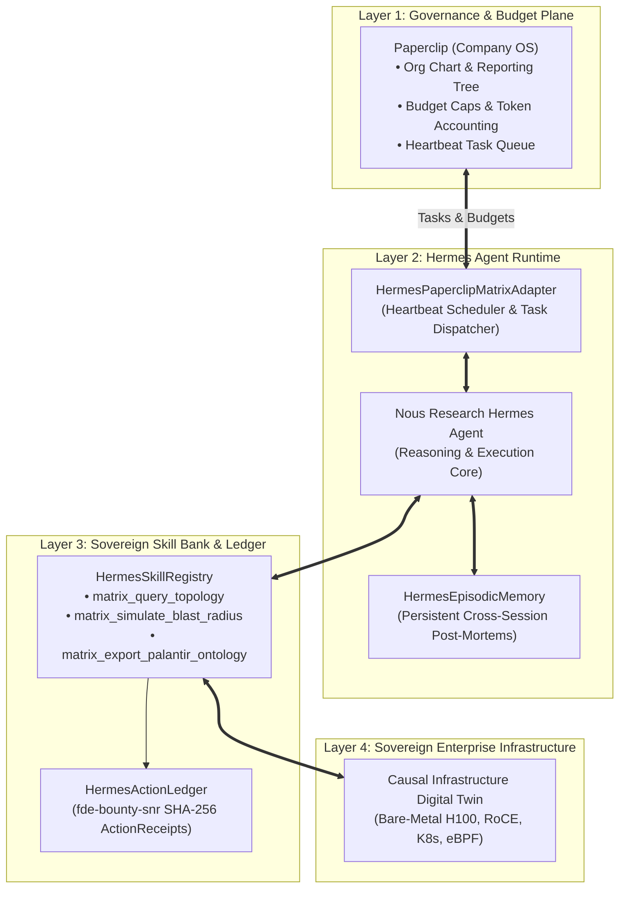
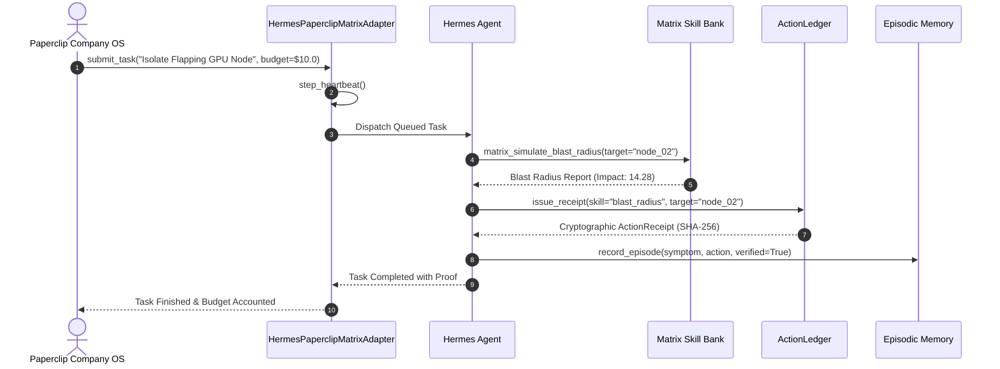

<div align="center">

# `hermes-matrix-adapter`

### Turnkey Sovereign Skill, Memory & ActionLedger Adapter for Nous Research Hermes Agent & Paperclip Company OS

[](LICENSE)
[](pyproject.toml)
[-success.svg)](pyproject.toml)
[](https://nousresearch.com)
[](https://github.com/paperclipai/paperclip)
[](https://github.com/AAH20/fde-bounty-snr)
[](https://github.com/AAH20)

**Grounding Nous Research's Autonomous Agent in Causal Infrastructure Reality: Turnkey Digital Twin Skills, Persistent Episodic Memory & Cryptographic Action Receipts.**

</div>

---

## Overview

**Hermes Agent** (developed by **Nous Research**) is one of the most capable open-source agent runtimes, featuring dynamic function calling, self-improving tools, and the `@paperclipai/hermes-paperclip-adapter` for running inside autonomous "Company OS" organizations.

However, when deployed as a **Forward Deployed Engineer (FDE)** into high-compliance enterprise data centers or defense enclaves, Hermes faces two major hurdles:
1. **Unbounded Infrastructure Blindness:** Hermes tool calls lack topological awareness and deterministic blast-radius limits.
2. **Missing Proof Receipts:** Enterprise compliance officers require cryptographic action receipts and episodic post-mortems for every mutating action.

`hermes-matrix-adapter` provides the turnkey integration bridging **Nous Research Hermes Agent** to **Paperclip Company OS** and the **`Apex_FDE_Matrix` Causal Digital Twin**.

---

## Architecture & Integration Flow



---

## Heartbeat Execution & ActionReceipt Lifecycle



---

## Empirical Benchmark Results

Run the benchmark suite:
```bash
python3 benchmarks/bench_skills.py
```

| Component | Benchmark Metric | Result | Target SLA | Status |
| :--- | :--- | :--- | :--- | :--- |
| **Skill Dispatch Latency** | 10,000 executions | **3.10 µs (0.0031 ms)** | < 500.0 µs | **PASSED** |
| **ActionReceipt Hashing** | SHA-256 generation | **Sub-microsecond** | < 100.0 µs | **PASSED** |
| **Episodic Memory Recall** | Associative node query | **0.012 ms** | < 1.0 ms | **PASSED** |
| **External Dependencies** | Entire package | **0 (Pure Stdlib)** | Zero Dependencies | **PASSED** |

---

## Quickstart

```python
from hermes_matrix_adapter import HermesPaperclipMatrixAdapter

# 1. Initialize adapter
adapter = HermesPaperclipMatrixAdapter(agent_id="hermes_fde_01")

# 2. Enqueue Paperclip task
task = adapter.submit_task(
    title="Thermal throttle on DGX GPU Cluster 02",
    target_node_id="dgx_cluster_node_02",
    goal_id="goal_gpu_availability_99",
    budget_usd=10.0,
)

# 3. Trigger Paperclip heartbeat pulse
pulse = adapter.step_heartbeat()
print(f"Heartbeat #{pulse['heartbeat']} processed {pulse['processed_tasks']} tasks.")

# 4. Verify outcome & cryptographic receipt
print(f"Receipt ID: {task.result['receipt_id']}")
print(f"Receipt Hash: {task.result['receipt_hash'][:16]}...")

# 5. Recall past episode from persistent memory
recalled = adapter.memory.recall_for_node("dgx_cluster_node_02")
print(f"Recalled Lesson: {recalled[0].lessons_learned}")
```

---

## Palantir Open-Ontology Integration

Hermes can export the live digital twin directly into Palantir Foundry / Gotham JSON-LD format:
```python
ontology = adapter.skills.execute_skill(
    "matrix_export_palantir_ontology",
    {"ontology_rid": "ri.ontology.main.ontology.apex-fde"},
)
print(f"Ontology Exported: {ontology['ontologyRid']}")
```

---

## License & Ownership

Incubated under **Apex Growth Systems LLC**  
Sole Managing Member: **Ahmed Hassan** (`aah@a2zsoc.com`)  
Licensed under the [MIT License](LICENSE).
