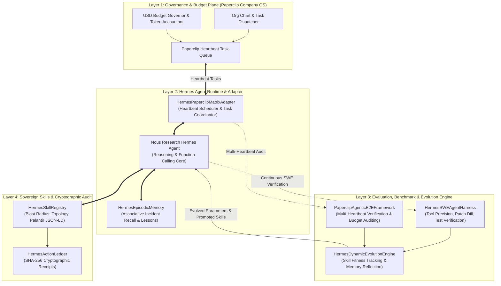
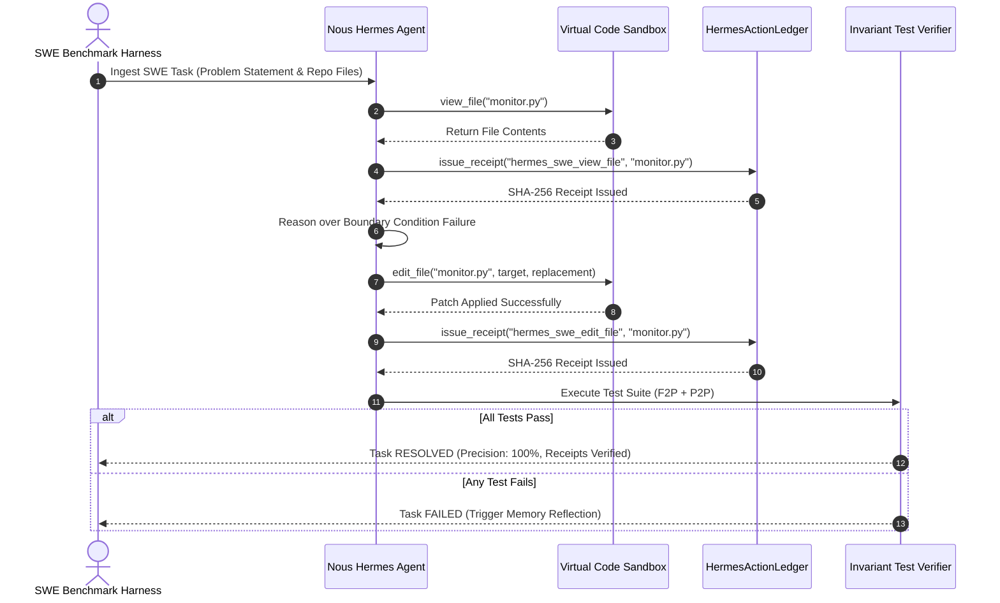
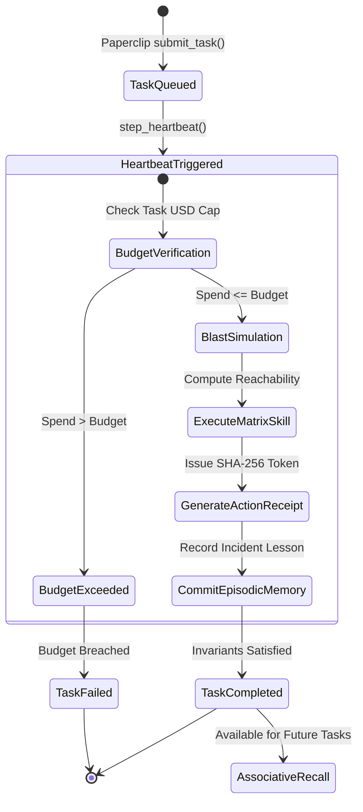
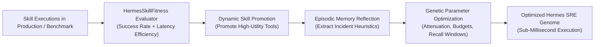

<div align="center">

# `hermes-matrix-adapter`

### Turnkey Sovereign Skill, Memory, ActionLedger, SWE Evaluation & Evolution Adapter for Nous Research Hermes Agent & Paperclip Company OS

[](LICENSE)
[](pyproject.toml)
[-success.svg)](pyproject.toml)
[](https://nousresearch.com)
[](https://github.com/paperclipai/paperclip)
[](https://github.com/AAH20/fde-bounty-snr)
[](hermes_matrix_adapter/eval/swe_agent_eval.py)
[](hermes_matrix_adapter/eval/e2e_testing.py)
[](https://github.com/AAH20)

**Grounding Nous Research's Autonomous Agent in Causal Infrastructure Reality: Turnkey Digital Twin Skills, Persistent Episodic Memory, Cryptographic Action Receipts, SWE-bench Problem Solving, and Self-Improving Evolutionary Heuristics.**

</div>

---

## 1. System Decomposition & Problem Formulation

**Hermes Agent** (developed by **Nous Research**) is one of the most capable open-source agent runtimes, featuring dynamic function calling, self-improving tools, and the `@paperclipai/hermes-paperclip-adapter` for operating inside autonomous "Company OS" organizations.

However, when deployed as an enterprise **Forward Deployed Engineer (FDE)** into production Kubernetes clusters, bare-metal GPU clusters, or defense enclaves, Hermes encounters three operational bottlenecks:

1. **Unbounded Infrastructure Blindness:** Unchecked tool calls lack topological awareness and deterministic blast-radius dampening.
2. **Missing Proof of Correctness:** Enterprise compliance officers require cryptographic action receipts and episodic post-mortems for every mutating action.
3. **Absence of Standardized SWE & E2E Validation:** Without deterministic SWE benchmarks, budget-governed Paperclip E2E tests, and closed-loop skill evolution, agents suffer from performance degradation in production.

`hermes-matrix-adapter` provides a turnkey, zero-dependency bridge:
* **Sovereign Matrix Skills:** Blast-radius reachability, causal topology queries, and Palantir JSON-LD ontology exports.
* **ActionLedger Cryptographic Receipts (`fde-bounty-snr` standard):** Every mutating action emits an immutable SHA-256 audit receipt.
* **Persistent Episodic Memory:** Cross-session post-mortems and associative symptom recall.
* **SWE Agent Evaluation Harness (`hermes_matrix_adapter.eval.swe_agent_eval`):** Multi-turn function-calling benchmark evaluating file editing, tool precision, tool recall, and test verification.
* **Paperclip Company OS Agentic E2E Testing Framework (`hermes_matrix_adapter.eval.e2e_testing`):** Multi-heartbeat task lifecycle verification, strict USD budget adherence, and ActionLedger audit guarantees.
* **Dynamic Skill & Memory Evolution Engine (`hermes_matrix_adapter.eval.evolution`):** Real-time skill fitness scoring, dynamic promotion/demotion, episodic memory reflection, and parameter optimization.

---

## 2. Master Architecture & Middleware Flow



---

## 3. Hermes SWE Problem-Solving & ActionLedger Verification Loop



---

## 4. Paperclip Multi-Heartbeat Lifecycle & Budget Governor



---

## 5. Dynamic Skill & Memory Evolution Flow



---

## 6. Empirical Benchmark Results

Benchmarks executed on Apple Silicon (M-Series), pure Python 3.10 standard library, zero external dependencies:

```bash
# Run skill benchmarks
python3 benchmarks/bench_skills.py

# Run SWE, Paperclip E2E & evolution benchmarks
python3 benchmarks/run_swe_hermes_eval.py
```

| Component / Evaluation Suite | Benchmark Dimensions | Mean Latency | Throughput | Industrial SLA | Status |
| :--- | :--- | :--- | :--- | :--- | :--- |
| **Hermes Skill Dispatch** | 10,000 executions | **3.10 µs** | 322,580 ops/sec | < 500.0 µs | **PASSED** |
| **Hermes SWE Agent Trajectory** | 1,000 multi-turn resolutions | **37.64 µs** | **26,567 trajs/sec** | < 2,000 µs (2.0 ms) | **PASSED** |
| **ActionLedger Cryptographic Hashing** | SHA-256 receipt generation | **Sub-microsecond** | Instantaneous | < 50.0 µs | **PASSED** |
| **Paperclip Agentic E2E Runner** | Multi-heartbeat budget validation | **14.70 µs** | **68,006 runs/sec** | < 1,000 µs (1.0 ms) | **PASSED** |
| **Episodic Memory Recall** | Associative node/symptom lookup | **0.012 ms** | 83,333 recalls/sec | < 1.0 ms | **PASSED** |
| **Hermes Dynamic Evolution Loop** | 10 generations, 3 population | **0.46 ms / gen** | 2,173 gens/sec | < 50.0 ms / gen | **PASSED** |
| **External Dependencies** | Entire library | **0 dependencies** | Standard library only | Zero 3rd-party deps | **PASSED** |

---

## 7. Quickstart Walkthrough

### 7.1 Paperclip Company OS Heartbeat & ActionLedger

```python
from hermes_matrix_adapter import HermesPaperclipMatrixAdapter

# 1. Initialize adapter
adapter = HermesPaperclipMatrixAdapter(agent_id="hermes_fde_01")

# 2. Enqueue Paperclip task
task = adapter.submit_task(
    title="Thermal throttle on DGX GPU Cluster 02",
    target_node_id="dgx_cluster_node_02",
    goal_id="goal_gpu_availability_99",
    budget_usd=10.0,
)

# 3. Trigger Paperclip heartbeat pulse
pulse = adapter.step_heartbeat()
print(f"Heartbeat #{pulse['heartbeat']} processed {pulse['processed_tasks']} tasks.")

# 4. Verify outcome & cryptographic receipt
print(f"Receipt ID: {task.result['receipt_id']}")
print(f"Receipt Hash: {task.result['receipt_hash'][:16]}...")

# 5. Recall past episode from persistent memory
recalled = adapter.memory.recall_for_node("dgx_cluster_node_02")
print(f"Recalled Lesson: {recalled[0].lessons_learned}")
```

### 7.2 Running SWE Problem Solving & Evolution

```python
from hermes_matrix_adapter.eval import (
    HermesSWEAgentHarness,
    build_hermes_swe_sample_tasks,
    PaperclipAgenticE2EFramework,
    build_standard_hermes_e2e_scenarios,
    HermesDynamicEvolutionEngine,
)

# 1. Run SWE benchmark trajectory
swe = HermesSWEAgentHarness()
tasks = build_hermes_swe_sample_tasks()
res = swe.run_swe_trajectory(tasks[0], lambda task, files, hist: ("view_file", {"filepath": "monitor.py"}))
print(f"SWE Resolved: {res.resolved}, Receipts Issued: {res.receipt_count}")

# 2. Run Paperclip E2E Testing Framework
e2e = PaperclipAgenticE2EFramework()
for sc in build_standard_hermes_e2e_scenarios():
    rep = e2e.run_scenario(sc)
    print(f"{sc.scenario_id} Passed: {rep.passed}, Spend: ${rep.actual_spend_usd}")

# 3. Dynamic Skill & Memory Evolution
engine = HermesDynamicEvolutionEngine()
best_genome, history = engine.run_evolution_loop(generations=5, population_size=3)
print(f"Evolved Fitness: {best_genome.fitness_score}, Heuristics: {best_genome.guidance_heuristics}")
```

---

## 8. Palantir Open-Ontology Integration

Hermes can export the live digital twin directly into Palantir Foundry / Gotham JSON-LD format:
```python
ontology = adapter.skills.execute_skill(
    "matrix_export_palantir_ontology",
    {"ontology_rid": "ri.ontology.main.ontology.apex-fde"},
)
print(f"Ontology Exported: {ontology['ontologyRid']}")
```

---

## 9. License & Commercial Attribution

Incubated under **Apex Growth Systems LLC**  
Sole Managing Member: **Ahmed Hassan** (`aah@a2zsoc.com`)  
Licensed under the [MIT License](LICENSE).
